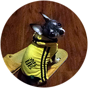

<head>
<link rel="stylesheet" href="css/animate.css">

</head>

   

<h2> 
 Hello, my name is Jim. 

<h5> 

 
 

 
 
Degree:
 
Ph.D. in Personality, Life and Mentors.
 
M.A. Candidate, Johns Hopkins University.
 
B.A., University of California, Los Angeles.

<h2> 
   

... And, this is Eggie.

<h5>

She is the multiplier of joy and divider of sorrow.
 
 
 

 
 
Pedigree:
 
Cute, Genetics.

         